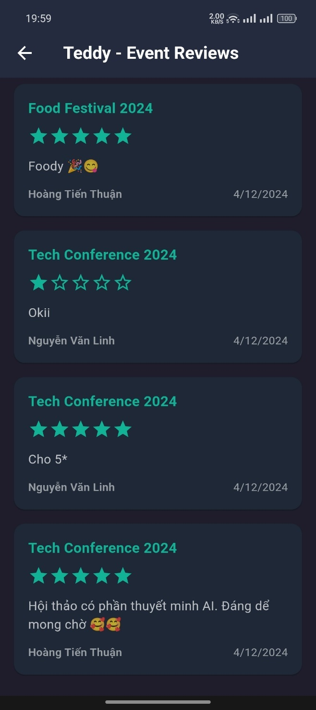
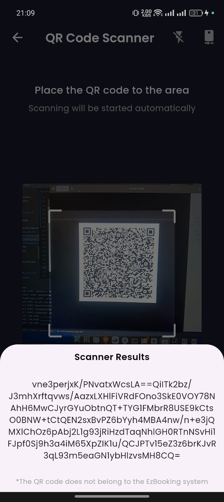

# oezbooking-app - Event Management System for Organizers

**oezbooking-app** is an event management platform designed for organizers to create, manage, and track events and ticket sales. Organizers can efficiently manage their events, view ticket sales, track revenue, and interact with users on the platform.

## Features for Organizers

As an **Organizer**, you will have access to the following features:

- **Create Events**: Organizers can easily create and manage events, providing event details like title, description, date, time, location, and ticket pricing.
- **Manage Tickets**: View the number of tickets sold, available tickets,....
- **Scan Tickets (QR Code)**: Use the built-in QR code scanner to validate tickets at the event entry gate, ensuring only valid ticket holders are allowed access.
- **Track Revenue**: View real-time statistics about sales, orders, and revenue for your events.
- **Order Management**: View and manage orders, including user details and payment status.
- **User Interaction**: Organizers can interact with users through ticket sales, event updates, and notifications.

## Tech Stack

- **Frontend**: Flutter (Mobile for Android/IOS)
- **Backend**: Firebase (Firestore, Authentication)
- **State Management**: BLoC
- **Architecture**: Clean Architecture

## Screenshots
<div style="display: flex; gap: 10px;">
  
  
  
  
  
  
  
  
  
  
  
  
  
  
  
  
  
  
  
  
</div>

## Setup

### Prerequisites

- Flutter installed on your machine: [Flutter installation guide](https://flutter.dev/docs/get-started/install)
- Firebase project set up and connected: [Firebase setup guide](https://firebase.google.com/docs/flutter/setup)

### Installation

1. Clone the repository:
   ```bash
   git clone https://github.com/thuanyg/oezbooking.git
   cd oezbooking-app
